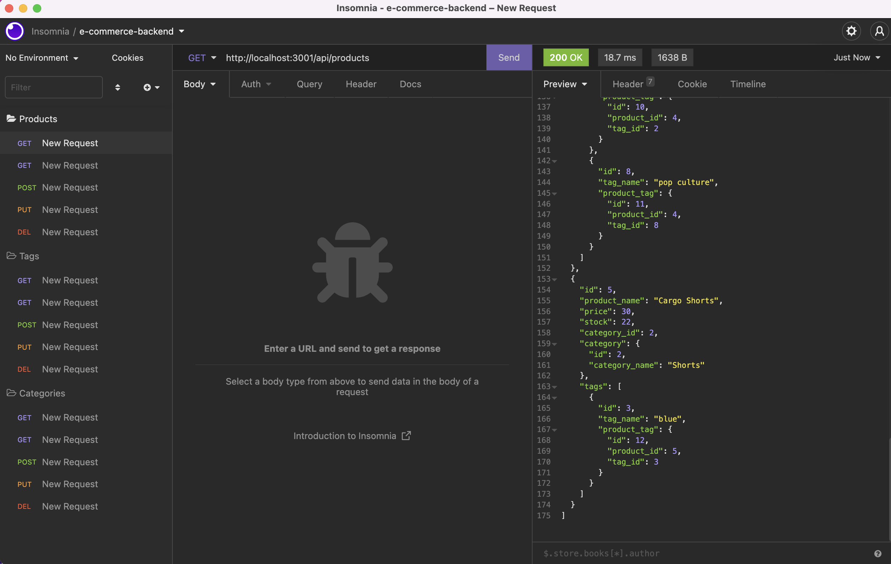
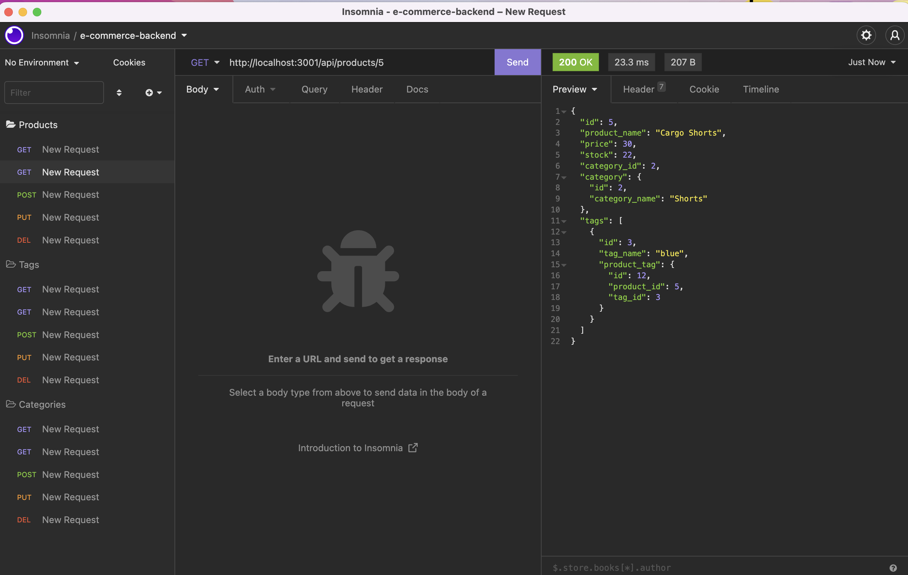
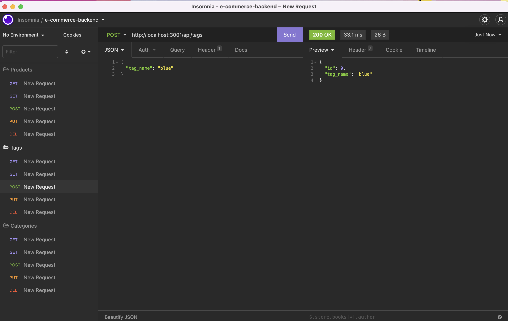
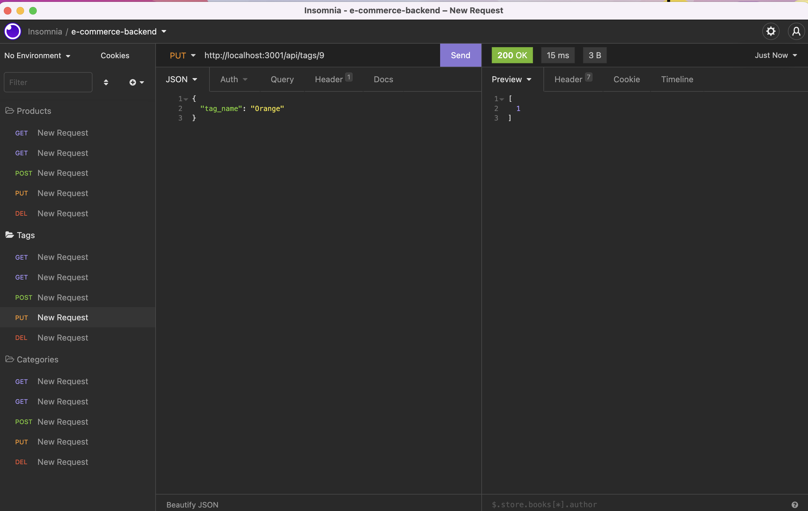
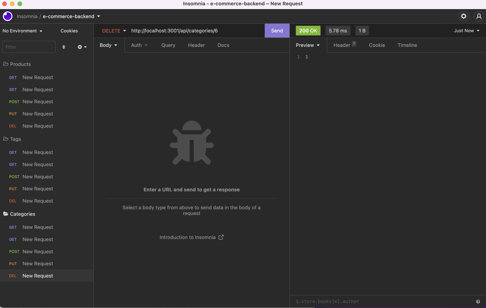

# E-commerce-backend

## Description
This backend application allows a user to manipulate the ecommerce database using Insomnia.  The user can GET, POST, PUT, and DELETE data.  It was made with node.js, express.js, and Sequelize to communicate with the MySQL database.

## Installation/Directions
First, install required dependencies by running "npm install" in the command line.  Fill in your MySQL username and password into the .env.EXAMPLE file and be sure to rename it ".env".  Then run MySQL by typing "mysql -u root - p" and enter your password.  Type "SOURCE db/schema.sql" and then "USE ecommerce_db".  Exit the MySQL shell by typing "quit".  Next populate the database by running the command "npm run seed".  Start the server with the command "npm start".  Open insomnia and operate the routes using http://localhost:3001/api/...
* api/products
* api/categories
* api/tags

##  Screenshots

GET all products
 
GET single product 
 
POST new tag
 
PUT (change) tag
 
DELETE a category
 

## Demo Video
https://drive.google.com/file/d/13OTA388o3ABnO2ZzNm9Ew3mV8_VxVN_L/view

## Contributions
Created by Chris Hodges, starter code provided by UNC Bootcamp.

## Questions
For any questions, contact me at chrisdhodges12@gmail.com or find me on GitHub at https://github.com/chrisdhodges12
